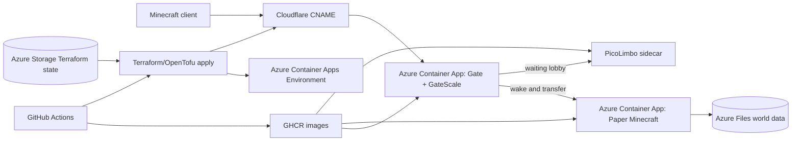

# mc-server

Nix-managed Minecraft server stack. It builds local container images for Gate, PicoLimbo, and Paper Minecraft, includes the GateScale plugin/runtime packaging, and contains Terraform/OpenTofu infrastructure for deployment.

## Architecture



## Local setup

Prerequisites: Nix with flakes enabled, Docker, and direnv if you want automatic shell setup.

```sh
nix develop
just dev-up
```

This builds and loads the dev images, then starts `docker-compose.local.yml`. Connect to Minecraft on `localhost:25565`.

## Deployment

Production deploys run from GitHub Actions. The bootstrap Terraform stack creates Azure state storage, the Azure OIDC app used by Actions, the production GitHub environment, deployment variables, and generated GitHub secrets.

### 1. Prepare accounts

You need:

- Azure CLI access to the target subscription.
- GitHub CLI access to the target repository.
- A Cloudflare zone for the Minecraft domain.
- Terraform or OpenTofu in your shell; `nix develop` provides both.

Log in:

```sh
az login
az account set --subscription "<subscription-id>"
gh auth login
```

### 2. Create bootstrap tokens

Create a temporary Cloudflare API token at https://dash.cloudflare.com/profile/api-tokens.

Use a custom token with these permissions, matching [docs/cloudflare.png](docs/cloudflare.png):

- `Account / API Tokens / Edit`
- `Zone / Zone / Read`

Scope it to the account and zone that contain `minecraft_domain`. This token is only used locally by bootstrap so Terraform can create the narrower GitHub Actions deploy token.

Export credentials:

```sh
export GITHUB_TOKEN="$(gh auth token)"
export CLOUDFLARE_API_TOKEN="<temporary-cloudflare-token>"
```

### 3. Bootstrap Azure, GitHub, and Cloudflare

Create local bootstrap variables:

```sh
cp infra/bootstrap/bootstrap.auto.tfvars.example infra/bootstrap/local.auto.tfvars
$EDITOR infra/bootstrap/local.auto.tfvars
```

Set:

- `github_owner` and `github_repository`
- `resource_name_prefix`, 3-18 lowercase letters, numbers, or hyphens
- `minecraft_domain`, for example `mc.example.com`
- `cloudflare_zone_id`
- `state_resource_group_name`
- `state_storage_account_name`, globally unique, 3-24 lowercase letters or numbers

Run bootstrap:

```sh
terraform -chdir=infra/bootstrap init
terraform -chdir=infra/bootstrap apply
```

Bootstrap creates:

- Azure resource groups for app resources and Terraform state.
- Azure Blob Storage backend for production state.
- Azure Entra app and federated credential for GitHub Actions OIDC.
- GitHub `production` environment variables.
- GitHub `CLOUDFLARE_API_TOKEN` and `VELOCITY_FORWARDING_SECRET` environment secrets.
- A zone-scoped Cloudflare token with `Zone Read` and `DNS Write`.

Inspect the generated handoff values:

```sh
terraform -chdir=infra/bootstrap output backend_config
terraform -chdir=infra/bootstrap output github_actions_variables
```

### 4. Deploy

Push to `main`:

```sh
git push origin main
```

The `images` workflow builds the `gate-scale`, `picolimbo`, and `minecraft` images with Nix, pushes SHA-tagged images to GHCR, then applies `infra/` with Terraform. Terraform creates the Azure Container Apps environment, the Gate app, the Minecraft app, Azure Files storage, Log Analytics, and the Cloudflare CNAME for `minecraft_domain`.

### 5. Profit

After the workflow succeeds:

```sh
terraform -chdir=infra output gate_fqdn
terraform -chdir=infra output gate_port
```

Connect to `minecraft_domain` on port `25565`. 
